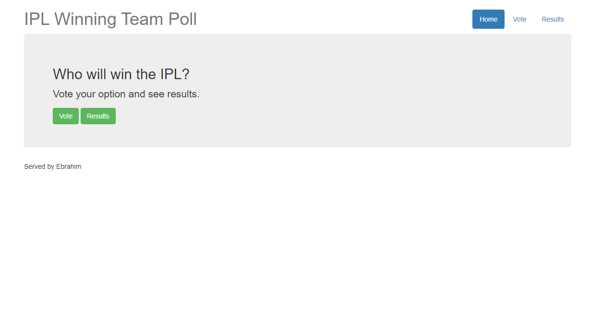
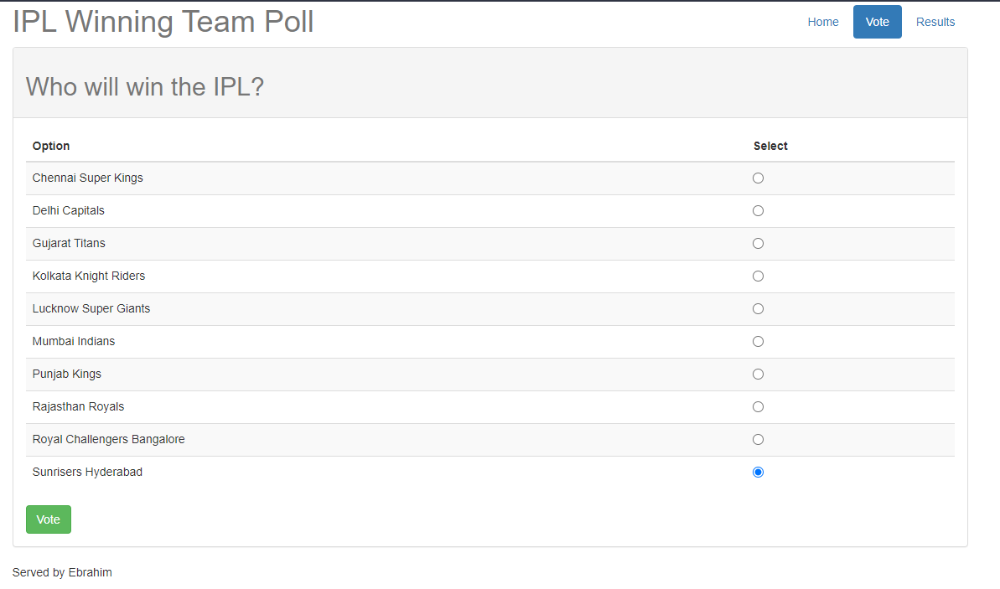
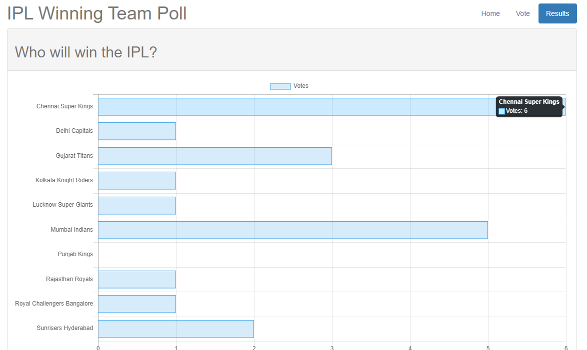

# Flask-voting-app-for-IPL-teams

<h3>WEBX IA 5</h3>
A sample web poll application written in Python (Flask).
Users will be prompted with a poll question and related options. They can vote preferred option(s) and see poll results as a chart. Poll results are then loaded into an internal DB based on sqlite. As alternative, the application can store poll results in an external MySQL database.

<h1>Web Application</h1>

<h1>Installing Process</h1>
Install the dependencies

    pip install flask
    pip install flask-sqlalchemy
    pip install mysql-python

and start the application

    python app.py
    Check if a poll already exists into db
    * Running on http://0.0.0.0:5000/ (Press CTRL+C to quit)

 <h1>References</h1>
 1.<a href="https://www.tutorialspoint.com/flask/index.htm">Tutorials Point</a> 
 2.<a href="https://www.youtube.com/watch?v=Z1RJmh_OqeA">Introduction on Flask</a>
